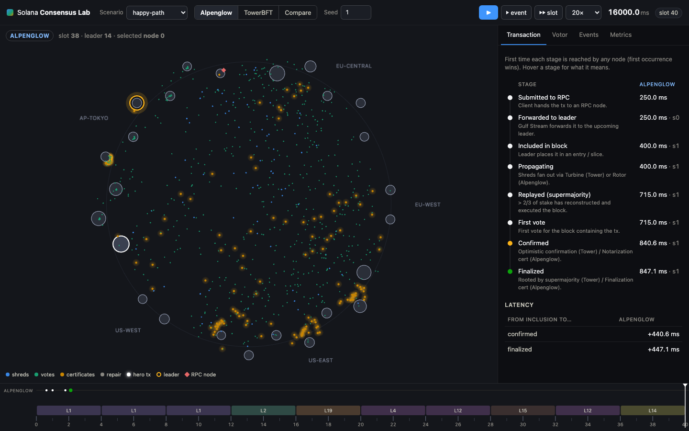

# Solana Consensus Lab

**An interactive, paper-faithful simulator that shows how a transaction moves through Solana consensus, side by side under TowerBFT (today) and Alpenglow (SIMD-0326).**

Built as a free, open-source teaching tool for Solana education programs (School of Solana, Turbin3, Solana School, Rektoff) and for anyone who wants to *see* why Alpenglow finalizes in ~150 ms where TowerBFT needs ~12.8 s.

- **Deterministic Rust core** (`crates/sim-core`): a discrete-event simulator with a realistic six-region latency model, per-node bandwidth, and fault injection (offline stake, partitions, delay, loss). Same seed ⇒ byte-identical trace.
- **Two protocols on one engine**
  - **TowerBFT**: PoH-paced slots, Turbine tree propagation, vote *transactions* to the leader, tower lockouts that double per confirmation, depth-8 threshold check, 38% switching threshold, heaviest-subtree fork choice, optimistic confirmation at ⅔, root at 32 confirmations.
  - **Alpenglow**: Votor's two concurrent paths (fast: 80% notarize → fast-finalization; slow: 60% notarize → 60% finalize), the full per-slot state machine from white paper v1.1 (`Voted`, `VotedNotar`, `BadWindow`, `ItsOver`, `BlockNotarized`, `ParentReady`), SafeToNotar / SafeToSkip fallbacks, Skip certificates, ParentReady + Δblock pacing, Rotor single-hop relays (or Turbine, as mainnet ships first), block repair, and the 20+20 resilience model.
- **Web UI** (`web/`): React + PixiJS animation of validators, shreds, votes and certificates, driven by the Rust core compiled to WebAssembly and running in a Web Worker. Inspectors for the Votor flags, Pool tallies with 20/40/60/80% thresholds, the lockout tower, the fork tree, certificates, and a transaction stepper.
- **Headless CLI** (`consensus-lab`): run, inspect, replay, parameter sweeps to CSV.



## Quick start

```bash
# Rust core + CLI
cargo test --workspace
cargo run -p sim-cli -- scenarios
cargo run -p sim-cli -- run --scenario happy-path --protocol both
cargo run -p sim-cli -- run --scenario leader-down --protocol alpenglow --events 40 --only tx_stage,certificate,timeout
cargo run -p sim-cli -- inspect --scenario partition-heal --protocol tower --node 3 --at-ms 3000
cargo run -p sim-cli -- run --scenario happy-path --out trace-{protocol}.jsonl
cargo run -p sim-cli -- replay --trace trace-alpenglow.jsonl --at-ms 900
cargo run -p sim-cli -- sweep --scenario offline-25pct --param faults.0.target.stake_pct=0..0.4:0.05 --seeds 10 --csv sweep.csv

# Web UI (needs rustup target wasm32-unknown-unknown and wasm-bindgen-cli 0.2.128)
./scripts/build-wasm.sh
cd web && bun install
bun run dev        # http://localhost:5173
bun run test       # vitest unit tests
bun run e2e        # Playwright smoke tests (bunx playwright install chromium once)
bun run build      # static site in web/dist (deployed to GitHub Pages by CI)
```

The UI runs the Rust core as WebAssembly inside a Web Worker; see `web/README.md` for the render loop and `docs/wasm-api.md` for the engine contract.

## What you see (seed 1, 25 validators)

| Scenario | Alpenglow: inclusion → finalized | TowerBFT: inclusion → confirmed | TowerBFT: inclusion → rooted |
|---|---|---|---|
| happy-path | 448 ms (fast path, 80%) | 507 ms | 12.7 s |
| offline-25pct | 632 ms (slow path, 60%+60%) | 663 ms | 15.9 s |
| leader-down (tx sent into a dead window) | 543 ms after the next live leader | 374 ms | 12.5 s |
| partition-heal (tx sent mid-partition) | 446 ms after the heal | 517 ms | 12.7 s |

Also visible: Alpenglow's Skip certificates when a leader is down, the stall-then-resume through a 50/50 partition with **no conflicting finalization**, and Tower's vote transactions (~400 per 16 s at 25 validators) consuming block space.

## Scenarios

`scenarios/*.json` — shared by the CLI and the web UI. Every parameter has a default, so a scenario can be as small as `{"name": "x"}`.

| Field | Meaning |
|---|---|
| `validators.count`, `validators.stake` | `{"dist":"pareto","alpha":1.5}` (default, mainnet-like), `uniform`, or `{"dist":"explicit","stakes":[...]}` |
| `network` | six-region preset (eu-central, eu-west, us-east, us-west, ap-tokyo, ap-singapore) with one-way latencies, log-normal jitter, 1 Gb/s egress; override `latency_ms`, `jitter_sigma`, `bandwidth_mbps`, `base_drop_prob` |
| `faults[]` | `offline` (`nodes`, `stake_pct`, or `leader_of_slot`), `partition` (`groups`, `stake_split`, or `regions`), `delay`, `drop`, each with `from_ms` / `to_ms` |
| `hero_tx` | `submit_at_ms`, `rpc_node` |
| `params.alpenglow` | `timeout_ms` (Δtimeout, default 900), `slices_per_block`, `shreds_per_slice`, `data_shreds`, `propagation: rotor|turbine`, thresholds |
| `params.tower` | `fec_data_shreds`, `fec_coding_shreds`, `fanout`, `threshold_depth`, `threshold_size`, `switch_threshold`, `max_lockout_history`, `optimistic_threshold`, `grace_ms` |

Teaching defaults keep shred counts small (8 per slice / FEC set, 4 needed) so propagation is visible; raise them toward mainnet values (64/32) for realism.

## Architecture

```
scenarios/*.json ──▶ sim-core (Rust, deterministic DES) ──▶ TraceEvent stream
                        │  protocol::alpenglow  (Rotor · Blokstor · Pool · Votor)
                        │  protocol::tower      (PoH · Turbine · Tower · ForkTree)
                        ├─▶ sim-cli   (run / inspect / replay / sweep)
                        └─▶ sim-wasm  ──▶ web/ (Worker ▸ event buffer ▸ PixiJS + React)
```

Everything the UI shows is derived from the trace, so the visualization can never disagree with the simulation. `docs/wasm-api.md` is the contract between the engine and the UI.

## Fidelity notes

- Vote and certificate thresholds, vote types, Votor handlers and the ParentReady rule follow the Alpenglow white paper v1.1 and SIMD-0326. BLS signatures are not simulated; certificates carry the aggregated stake and are trusted on receipt.
- Δtimeout defaults to 900 ms because a block is only voted on once all of its slices have arrived; lowering it below Δblock + propagation makes the cluster skip healthy leaders, which is a useful lesson in itself.
- TowerBFT follows Agave's `vote_state` (lockout doubling, `MAX_LOCKOUT_HISTORY = 31`), threshold check at depth 8 with ⅔, 38% switch threshold, heaviest-subtree fork choice restricted to replayed blocks, leader grace period, and block repair. PoH is modeled as the leader's clock, not as hashing.
- The network model is abstract (latency matrix + jitter + egress serialization); it is not a packet-level simulation.


## License

Apache-2.0. Contributions welcome.
