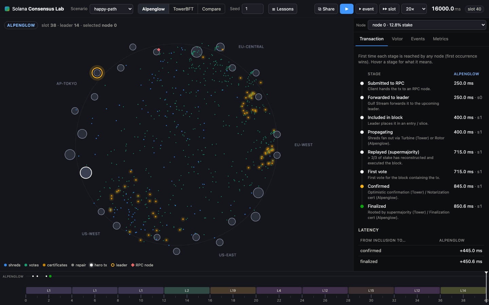

# Solana Consensus Lab

<p align="center"></p>

Watch a single transaction travel through Solana's consensus side by side, under the protocol Solana uses today and the one it's moving to.

Under Alpenglow that transaction is final in about **150 milliseconds**. Under TowerBFT the same transaction takes about **12.8 seconds**. This tool shows you where those seconds go.

> Not affiliated with or endorsed by the Solana Foundation yet. "Solana" is a trademark of Solana Foundation, used here only to name the protocol being simulated. The mark above is this project's own, vectorised from `SCL-logo.png`.

Built as a free, open-source teaching tool for Solana education programs and for anyone who would rather *see* consensus than read about it.




## What you see

Time from the transaction joining a block until it can no longer be undone. TowerBFT reaches *confirmed* first (optimistic, still reversible), then *rooted*, which is final; Alpenglow goes straight to final. Seed 1, 25 validators:

| Scenario | Alpenglow → final | TowerBFT → confirmed | TowerBFT → rooted |
| --- | --- | --- | --- |
| happy-path | 451 ms (fast path, 80%) | 513 ms | 12.7 s |
| ideal (tx rides the block's last slice) | 150 ms (fast path, 80%) | 187 ms | 12.4 s |
| offline-25pct | 563 ms (slow path, 60%+60%) | 493 ms | 17.8 s |
| leader-down (tx sent into a dead window) | 452 ms after the next live leader | 350 ms | 12.5 s |
| partition-heal (tx sent mid-partition) | 1.3 s after the heal (standstill re-broadcast, then 512 ms of consensus) | 495 ms | 12.7 s |
| twenty-twenty (21% offline, then a partition) | 462 ms (slow path) | 489 ms | not within 14 s |

`happy-path` and `ideal` run on the same healthy cluster, yet Alpenglow takes 451 ms in one and 150 ms in the other. The difference isn't consensus. It's **when the transaction lands in the block**. In `happy-path` it rides the block's first slice and waits for the leader to finish building; in `ideal` it rides the last slice, leaving only the voting.

## Try it

```bash
cargo test --workspace
cargo run -p sim-cli -- scenarios
cargo run -p sim-cli -- run --scenario happy-path --protocol both

./scripts/build-wasm.sh # needs: rustup target add wasm32-unknown-unknown, wasm-bindgen-cli 0.2.128
cd web && bun install && bun run dev    # http://localhost:5173
```

The CLI also replays saved traces, inspects one validator at a moment in time, and sweeps a parameter into a CSV. Run `consensus-lab --help` for the rest. Tests: `bun run test`, `bun run e2e`. Scenarios are small JSON files where every field has a default; write your own in the app's **custom JSON** editor.

## Lessons

Click **☰ Lessons**. Each loads a scenario and stops the clock at the moment that matters, after asking what you think happens.

1. One transaction, two protocols
2. Why votes on-chain cost block space
3. Skip certificates
4. Lockouts and why partitions hurt TowerBFT
5. 20+20

## How faithful is it?

- Vote thresholds and certificate types follow Alpenglow white paper v1.1 and SIMD-0326; real BLS signatures aren't simulated: a certificate arrives carrying its stake and is trusted.
- Standstill is modelled on purpose: votes are sent once, so after a split heals each half would think it had already voted. It's set to 2 s here so you can watch; mainnet waits far longer.
- PoH is modelled as the leader's clock rather than hashing, and the network is a table of latencies rather than a packet simulation.

Full list of what is and isn't modelled: [`docs/architecture.md`](docs/architecture.md).

## License

Apache-2.0. Contributions welcome. "Solana" is a trademark of Solana Foundation, used only to name the protocol being simulated.

Further reading: [`docs/protocols.md`](docs/protocols.md) both protocols as simulated · [`docs/architecture.md`](docs/architecture.md) module map, test map, honest limits · [`web/README.md`](web/README.md) render loop, adding a lesson, URL scheme · [`docs/wasm-api.md`](docs/wasm-api.md) engine ↔ UI contract
