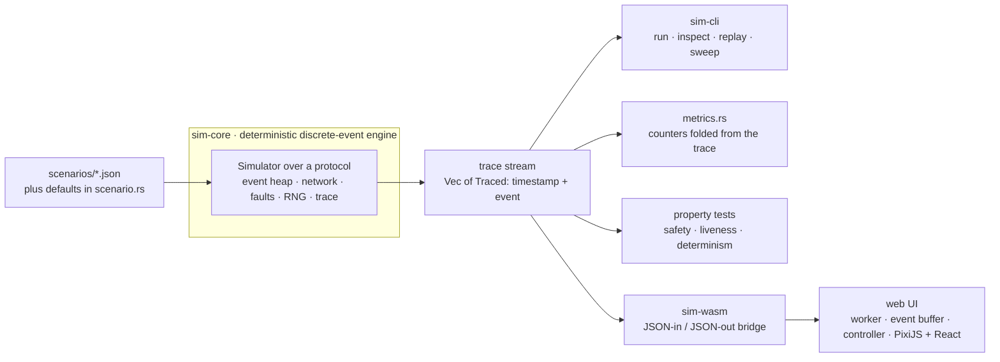
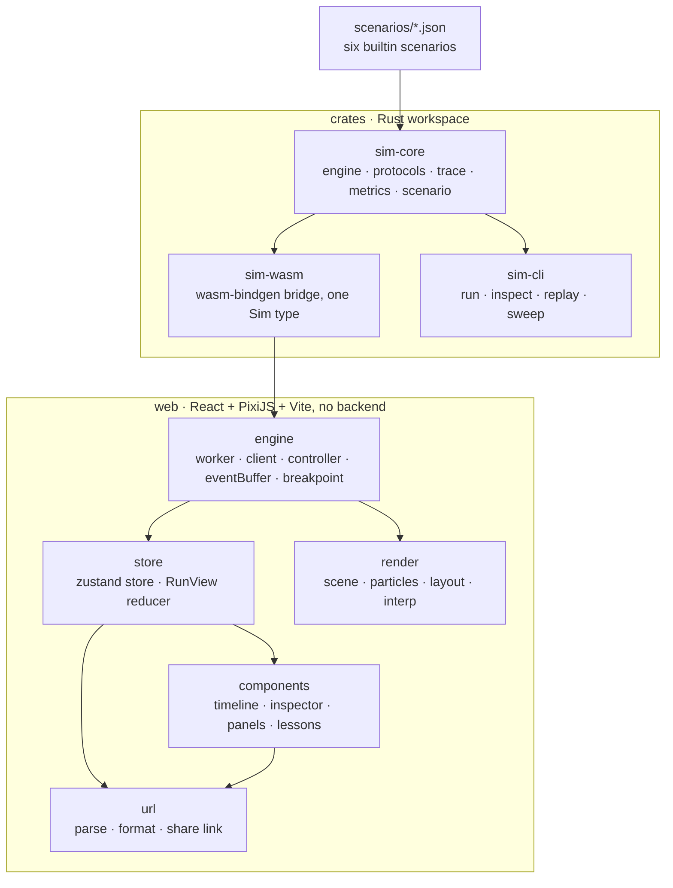
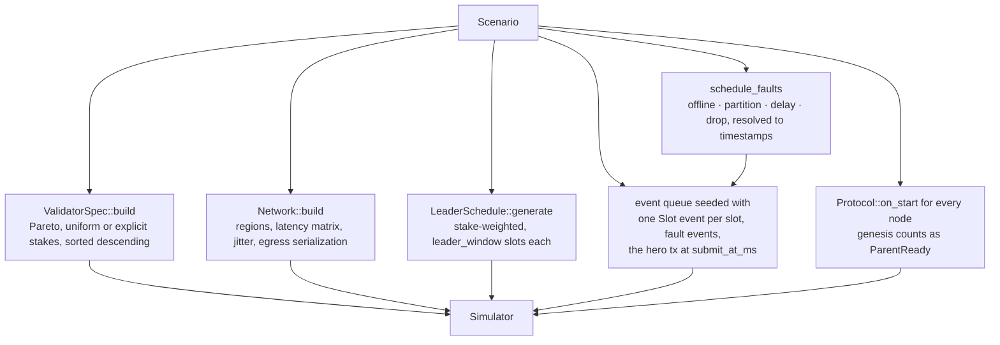
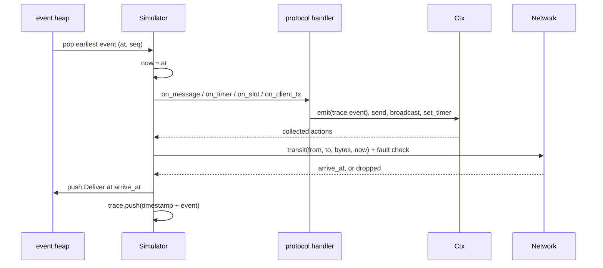
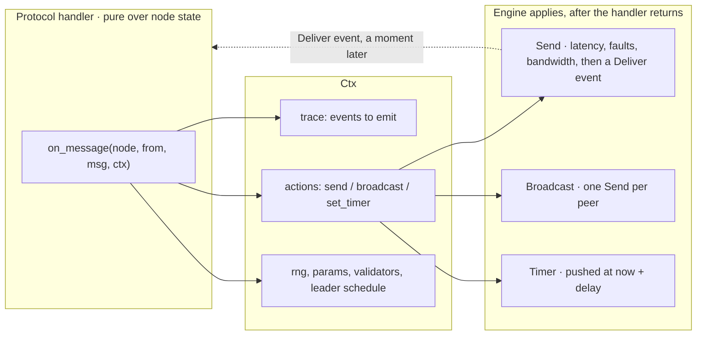
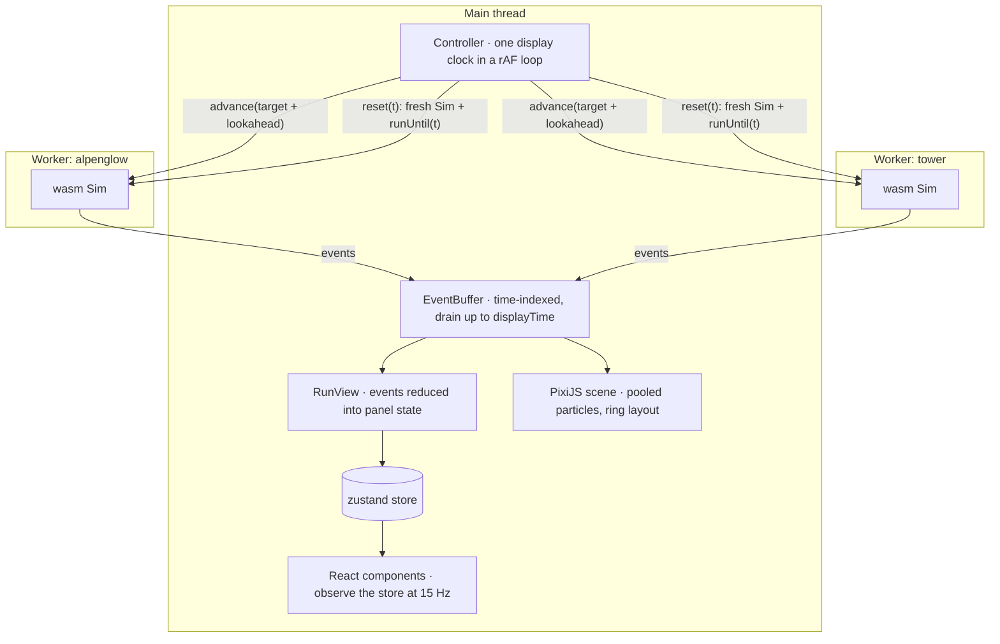

# Architecture

How Solana Consensus Lab is put together, for two audiences: **contributors** changing the code, and
**reviewers** deciding whether the thing is credible. It is a map, not a specification: the rules of
each protocol live in [`protocols.md`](protocols.md), the engine↔UI bridge contract in
[`wasm-api.md`](wasm-api.md), the front-end internals in [`web/README.md`](../web/README.md), and the
project plan in [`grant-roadmap.md`](grant-roadmap.md).

The whole system is three sentences:

1. One **deterministic discrete-event simulator** in Rust runs a scenario under TowerBFT *or*
   Alpenglow and emits a stream of trace events.
2. **Everything observable is that trace.** No side channel, no UI-side state that could disagree
   with the simulation.
3. Three consumers read it: the **CLI**, the **property tests**, and the **web UI** (Rust compiled to
   WebAssembly, driven frame by frame in a browser).

All diagrams below are [Mermaid](https://mermaid.js.org), so GitHub renders them and they diff like
code.

## 1. The shape of the system

Consequences worth stating, because they constrain everything else:

- The **UI never simulates**. It cannot draw a certificate that the engine did not emit, so the
  animation cannot lie about the protocol.
- The **CLI and the browser run the same code** on the same scenario and seed and produce the same
  trace, so a number in a lesson, a number in the README and a number in a bug report are the same
  number.
- Adding a fault, a protocol rule or a visualization never requires touching more than one layer:
  protocol rules live behind an event, the trace reaches every consumer at once.

## 2. Repository map

| Path | What lives there | Notes |
|---|---|---|
| `crates/sim-core/src/sim.rs` | Event heap, `step`, `run_until`, `run_to_end`, faults, snapshot/restore | The engine; knows nothing about either protocol's rules |
| `crates/sim-core/src/protocol/` | `alpenglow/` (Votor, Pool, Rotor), `tower/` (PoH, Turbine, tower, fork choice), shared `blokstor.rs`, `dissemination.rs`, reference `ping.rs` | Protocol logic |
| `crates/sim-core/src/trace.rs` | `TraceEvent`, the event union | Add anything observable here |
| `crates/sim-core/src/scenario.rs` | JSON schema, defaults, `BUILTIN` | Every field has a default |
| `crates/sim-core/src/network.rs`, `stake.rs`, `rng.rs`, `time.rs`, `tx.rs` | Latency model, validator set + leader schedule, seeded RNG, microsecond time, hero-tx stages | |
| `crates/sim-core/tests/properties.rs` | proptests: safety, liveness, determinism | Checked-in regression seeds |
| `crates/sim-wasm/src/lib.rs` | `Sim` (new / runUntil / step / inspect / metrics / snapshot) | Mirrors `docs/wasm-api.md` |
| `crates/sim-cli/src/main.rs` | Headless entry point | CSV export for sweeps |
| `web/src/engine/` | Worker protocol, display clock, event buffer, breakpoints | The render loop |
| `web/src/engine/liveClient.ts`, `runSource.ts` | The live producer: polls `api.devnet.solana.com` and emits the same `Traced` union. `RunSource` is the seam both producers satisfy | Behind Start, and only reached once a trace is asked for |
| `web/src/engine/devnetSend.ts` | Builds a real System transfer, has a wallet sign it, broadcasts, returns the signature | Dynamically imported, so the simulator never loads the Solana SDK |
| `web/src/store/` | zustand store + `RunView` (events → panel state) | |
| `web/src/render/` | PixiJS scene, pooled particles, ring layout, path interpolation | |
| `web/src/components/` | Brand (the project mark), TopBar + ClockReadout, Timeline, Inspector + NodePicker, Modal, Tooltip (`data-tip` driven), the Transaction/Votor/Tower/Events/Metrics panels, lessons | |
| `web/src/url/` | Address-bar state, share links, scenario compression | |

## 3. sim-core: the engine

### 3.1 From a scenario to a running simulation

`Simulator::new` turns JSON into a fixed world, then the queue is seeded.

All randomness comes from `rng::Rng` (xoshiro256\*\*) forked per subsystem with fixed tags in
`Simulator::new`, so validator stakes, node placement, leader selection, fault target picking and
latency jitter never share a stream, and any one of them can be changed without reshuffling the
others.

### 3.2 One step of the loop

The heap is keyed by `(time, insertion sequence)`, so two events at the same microsecond always run in
a fixed order. Messages are *scheduled*, not delivered inline: `Network::transit` returns an arrival
time and the engine pushes a `Deliver` event, which is what makes latency, partitions, node outages
and bandwidth ordinary cases rather than special ones.

### 3.3 The engine / protocol boundary

Protocol code is a set of pure handlers over per-node state. All side effects are returned as data
and applied by the engine *after* the handler returns.

Why it is built this way:

- Faults, latency and bandwidth are applied in **one** place, so a protocol cannot accidentally
  deliver a message instantly or ignore a partition.
- A protocol is testable without a network: call a handler, inspect the returned actions.
- `Protocol::ENGINE_SLOTS` says whether the engine's fixed slot clock means anything for that
  protocol. TowerBFT uses it (PoH ticks); Alpenglow ignores it and paces itself from
  `ParentReady + Δblock`.

## 4. The two protocols

Same engine, same trace, same UI. Only the rules differ.

| | TowerBFT (mainnet today) | Alpenglow (SIMD-0326) |
|---|---|---|
| Reference | Agave `vote_state` | White paper v1.1, Algorithms 1–2 |
| Clock | PoH: fixed `slot_ms` slots, leader windows | No global clock: `ParentReady + i·Δblock` |
| Dissemination | Turbine: shreds through a stake-weighted tree | Rotor: one stake-weighted relay per shred, single hop |
| Votes | Vote *transactions* packed into blocks (~300 B) | Vote *messages*, never on chain (150 B) |
| `confirmed` | ⅔ of stake's latest votes on the block | Notarization certificate (60% Notarize) |
| `finalized` | 32 stacked votes push the block out of the tower → root | Fast-Finalization certificate (80% Notarize) or Finalization certificate (60% Finalize) |
| Liveness model | lockout doubling (2, 4, 8 … slots), 38% switch threshold | Δtimeout, Skip certificates, standstill recovery |
| Modules | `protocol/tower/` | `protocol/alpenglow/` |

Shared code: `protocol/blokstor.rs` (shreds → block reconstruction, used by both) and
`protocol/dissemination.rs` (stake-weighted orderings, Turbine children, Rotor relay sampling, block
hashes). [`protocols.md`](protocols.md) documents the rules; this table only orients you.

## 5. The trace contract

`TraceEvent` in `crates/sim-core/src/trace.rs` is the API of the whole project. Families:

| Family | Events | Consumed by |
|---|---|---|
| Engine | `slot_start`, `msg_sent`, `msg_dropped`, `node_offline`/`node_online`, `partition_start`/`partition_end` | canvas (particles, dividers), metrics, sweep CSV |
| Blocks | `block_produced`, `block_received`, `block_replayed` | timeline, panels, Particles |
| Alpenglow | `vote`, `certificate`, `pool_event`, `votor_flag`, `timeout` | Votor panel, lesson breakpoints |
| Tower | `tower_update`, `fork_choice` | lockout bars, fork tree |
| Commitment | `commitment` (processed / confirmed / finalized) | transaction stepper, panels |
| Hero tx | `tx_stage`: `submitted`, `forwarded_to_leader`, `included_in_block`, `propagating`, `replayed`, `voted`, `confirmed`, `finalized` | the whole transaction panel and most lessons |
| Diagnostics | `log` | events feed, standstill / retry narration |

Rules for adding one:

1. Emit it from the protocol with `ctx.emit(...)`. If it is observable, it belongs here.
2. Mirror it in `web/src/engine/types.ts` and in `docs/wasm-api.md`.
3. If a panel should show it, add a case to `web/src/store/runView.ts` (`applyEvents`); if a metric
   should count it, add a case to `crates/sim-core/src/metrics.rs`.
4. If a lesson should stop on it, add a `Trigger` in `web/src/engine/breakpoint.ts`.

## 6. Determinism, serialization, and why the UI can rewind

Determinism is a hard invariant, not a nicety:

- All randomness flows through `rng::Rng`, forked per subsystem with fixed tags.
- Nothing that affects behaviour iterates a `HashMap`; ordered containers only (`BTreeMap`/`BTreeSet`).
- Events are totally ordered by `(time, insertion sequence)`.
- The `Simulator` is fully serde-serializable, so `snapshot`/`restore` continues a run exactly.

It is verified, not asserted: `both_protocols_are_deterministic` runs every builtin scenario under
both protocols twice and compares serialized traces; `snapshot_roundtrip_continues_identically`
covers serialization; `properties.proptest-regressions` is checked in so a found failure keeps failing
until fixed.

The payoff is in the browser. Scrubbing backwards does **not** ship snapshots to the UI: the worker
throws the simulation away, builds a fresh one and fast-forwards to the target time
(`web/src/engine/controller.ts`, `seek`). That is only possible because the engine is deterministic,
and it is why compare mode, share links and lesson "Back" are exact rather than approximate.

## 7. The web front end

- **One display clock, N workers.** Compare mode runs both protocols from the same scenario JSON and
  seed against the same clock. The clock never outruns a worker; it stalls instead of skipping.
- **Nothing per frame goes through React.** The controller drains events into a derived `RunView` and
  writes the store at most every 66 ms (≈15 Hz); the canvas is driven imperatively from the same
  drain. A 25-node run emits ~100k events, so events are never rendered as DOM (the Events feed is
  virtualised and capped at 400 rows).
- **The buffer is the agreement point.** Panels and canvas both read state produced by the same
  `drain(displayTime)`, so "now" cannot disagree between them.
- **Breakpoints clamp the clock before it advances** (`engine/breakpoint.ts`): a lesson step names a
  declarative trigger, the controller scans the buffered range for the first match and stops on its
  exact timestamp, so stops are frame-exact at any speed, no rewind.

[`web/README.md`](../web/README.md#architecture) owns the front-end detail; this is the boundary.

## 8. Surfaces

| Surface | Entry point | Use |
|---|---|---|
| CLI `run` | `cargo run -p sim-cli -- run --scenario happy-path --protocol both` | Hero-tx stages, certificates, message and byte counters |
| CLI `inspect` | `... inspect --scenario partition-heal --node 3 --at-ms 3000` | One validator's internal state at a point in time |
| CLI `replay` | `... replay --out trace.jsonl --until-ms 3000` | Summarize a recorded trace |
| CLI `sweep` | `... sweep --param faults.0.target.stake_pct=0..0.4:0.05 --seeds 10 --csv s.csv` | Parameter sweeps for research and bug reports |
| WASM | `Sim` in `crates/sim-wasm/src/lib.rs` | `new`, `runUntil`, `step`, `inspect`, `metrics`, `snapshot`/`restore`, `scenarioNames`, `builtinScenario`, `validateScenario` |
| Scenarios | `scenarios/*.json`, registered in `scenario.rs::BUILTIN` | Six builtins; the list ships inside the wasm and is also the UI picker |
| URL | `?scenario=…&mode=compare&seed=1&t=2700&node=3&tab=tower&lesson=…&step=…` | Shareable moments; custom scenarios compressed into `s=` |

## 9. Test map

| Layer | Protects | Command |
|---|---|---|
| Engine unit tests (`lib.rs`) | heap ordering, snapshot/restore, determinism of the reference protocol | `cargo test -p sim-core` |
| Protocol scenario tests (bottom of `protocol/*/mod.rs`) | the shipped claims: fast path, slow path under 25% offline, Skip certificates, no conflicting finality, the paper's 150 ms median | `cargo test -p sim-core` |
| Property tests (`tests/properties.rs`) | safety (no conflicting finalization), liveness (≤20% offline), determinism across every builtin scenario | `cargo test -p sim-core --test properties` |
| Web unit tests (`web/test/`) | event buffer, interpolation, tx stages, URL round trip, every breakpoint trigger, lesson registry | `cd web && bun run test` |
| Type check + bundle (`bun run build`) | the mirror of the Rust types in `web/src/engine/types.ts` is exact | `cd web && bun run build` |
| End-to-end (`web/e2e/`) | the app boots, the hero tx finalizes, a lesson runs end to end, a share link restores, the keyboard contract holds, and the layout survives 1440 down to 390 px wide | `cd web && bun run e2e` |

CI runs all of it, then builds the wasm first because the web build depends on it.

## 10. Where to add things

| I want to… | Touch | Gotcha |
|---|---|---|
| show something new | `trace.rs`, then mirror in `web/src/engine/types.ts` + `docs/wasm-api.md` | if a panel needs it, add an `applyEvents` case in `runView.ts` |
| add a scenario | `scenarios/*.json` + a `BUILTIN` entry, rebuild the wasm | measure the timings with the CLI before writing any copy |
| add a protocol parameter | `scenario.rs` (`Params`) with a `#[serde(default = …)]`, then read it through `ctx.params` | expose rules as parameters instead of simplifying them |
| add a fault | `scenario.rs::Fault` + `network.rs::schedule_faults`; enforcement already exists in `send` | keep `Target::StakePct` from overshooting a whale |
| add a lesson | `web/src/lessons/<id>.ts` + `index.ts`, bump the lesson-count assertion in `web/test/lessons.test.ts` | triggers must actually fire, so verify with `--events` in the CLI |
| add a panel | `components/panels/` reading a `RunView` field | panels read the store at 15 Hz; nothing per-frame |

## 11. Scope and honest limits

What this simulator is, stated plainly so nobody has to guess:

- **Validator count.** 25 by default, against ~1,500 in the paper's simulations. Propagation is
  simulated per message, so the *shape* of the latency distribution carries over but not its tail.
- **No Byzantine adversary yet.** Faults model crashes, partitions, delay and loss. Equivocation and
  double voting (the 20% wall) are milestone M4 in [`grant-roadmap.md`](grant-roadmap.md).
- **No cryptography.** Certificates carry aggregated stake and are trusted on receipt; the 20%
  double-sign argument is argued from thresholds, not from signature checks.
- **Execution time is a constant** (15 ms) rather than a function of the block's transactions.
- **The network is abstract**: a latency matrix with log-normal jitter and egress serialization, not a
  packet-level model. Shred counts are deliberately small (8 per slice, 4 needed) so propagation is
  visible in the animation rather than instantaneous.
- **Deterministic teaching values**: Δstandstill is 2 s instead of the paper's 10 s so partition
  recovery is watchable; shred counts and validator count are small for the same reason.

These are all parameterizable or milestone-scoped, and each is stated where it is defined: the point
of the exercise is that a reader can tell modelled rules from simplified ones.
